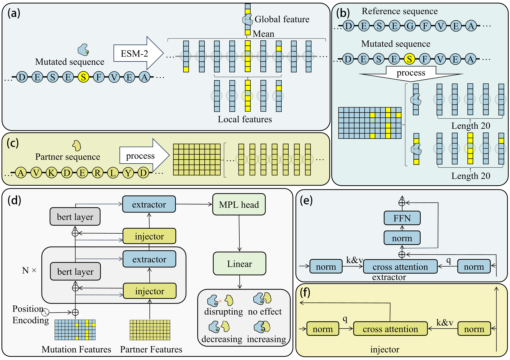

# TAPPI

## Installation

First clone the repository from GitHub:

```bash
git clone git@github.com:NENUBioCompute/TAPPI.git
cd TAPPI
```

Then install the required dependencies:

```bash
pip install -r requirements.txt
```

It is recommended to use a Python environment with Python ≥ 3.8 and PyTorch ≥ 2.0. All required dependencies are listed in requirements.txt for easy installation.

Download the model parameters from the [Figshare](https://figshare.com/ndownloader/files/62900644) and place them in the root directory of the project:

After installing the dependencies, the environment will be ready for running the TAPPI model and related experiments.

## Inference Example

You can run the following command to make a prediction using the `predict.py` script:

```bash
python predict.py \\
    --seq VSFRYIFGLPPLILVLLPVASSDCDIEGKDGKQYE \\
    --mutation Y5R \\
    --partner PPLILVLLPVASSDCDIEGKDGK
```

**Parameters:**

- `--seq` : The original protein sequence that you want to analyze.  
- `--mutation` : Mutation(s) to introduce in the original sequence. Use the format `OriginalResiduePositionNewResidue` (e.g., `Y5R` means tyrosine at position 5 is mutated to arginine). Multiple mutations can be specified separated by spaces (see below).  
- `--partner` : The sequence of partner protein interact with partner protein original.  

**Example: Multiple-point mutation prediction**

```bash
python predict.py \\
    --seq VSFRYIFGLPPLILVLLPVASSDCDIEGKDGKQYE \\
    --mutation Y5R I6A G8Y \\
    --partner PPLILVLLPVASSDCDIEGKDGK
```

In this example:  
- `Y5R` mutates tyrosine at position 5 to arginine  
- `I6A` mutates isoleucine at position 6 to alanine  
- `G8Y` mutates glycine at position 8 to tyrosine  

The script will output the predicted effect of these mutations.

### Evaluation Instructions

The evaluation results presented in this manuscript can be reproduced using the provided dataset and code. 

**Download the test dataset**  
   Download the test dataset from [Figshare](https://figshare.com/ndownloader/files/62913865) and place it in the root directory of this repository.

## Model Training

Before training the model, the input data needs to be preprocessed. You can run the preprocessing notebook provided here: [IMEx_preprocess.ipynb](https://github.com/NENUBioCompute/TAPPI/blob/main/preprocess/IMEx_preprocess.ipynb).

After preprocessing, train the model using:

```bash
python -m train.train
```


The obtained results are consistent with the conclusions derived from training using five-fold cross-validation with a fixed random seed for dataset splitting into training, validation, and test sets. The five-fold cross-validation dataset, as well as the data splitting and training procedures, can be reproduced by sequentially executing the [provided scripts](https://github.com/NENUBioCompute/TAPPI/blob/main/train/train_five_cross.ipynb).


## Introduction
 a deep learning framework utilizes PLM to predict protein-protein interaction variation trends 
 <div align="center">
    
</div>

**TAPPI** is a model for predicting the effects of mutations on protein–protein interactions (PPI). It classifies PPI variations into four categories: *Increasing*, *Decreasing*, *Disrupting*, and *No_Effect*.

## Extensions
We introduce extensions to improve class balance and to explicitly handle multi-point mutations across arbitrary distances.

[TAPPI-loss](https://github.com/NENUBioCompute/TAPPI/tree/main/extend/tappi-loss) employs a weighted GMH loss to improve prediction balance among different classes.

[TAPPI-multi](https://github.com/NENUBioCompute/TAPPI/tree/main/extend/tappi-multi) extends the framework to explicitly capture the cooperative effects of multi-point mutations at arbitrary distances.
